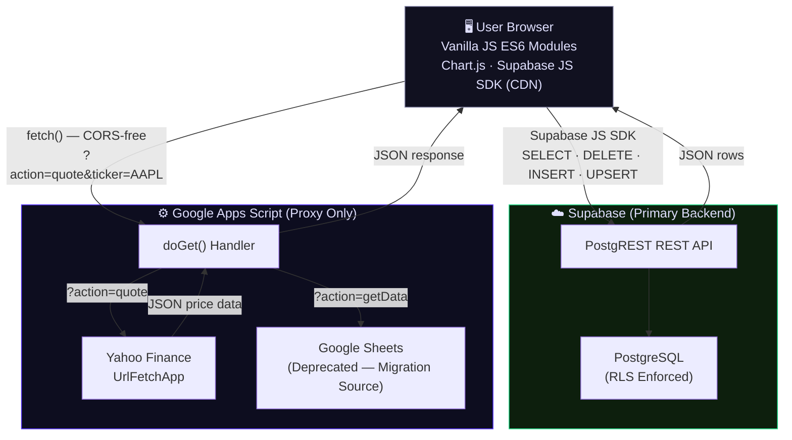
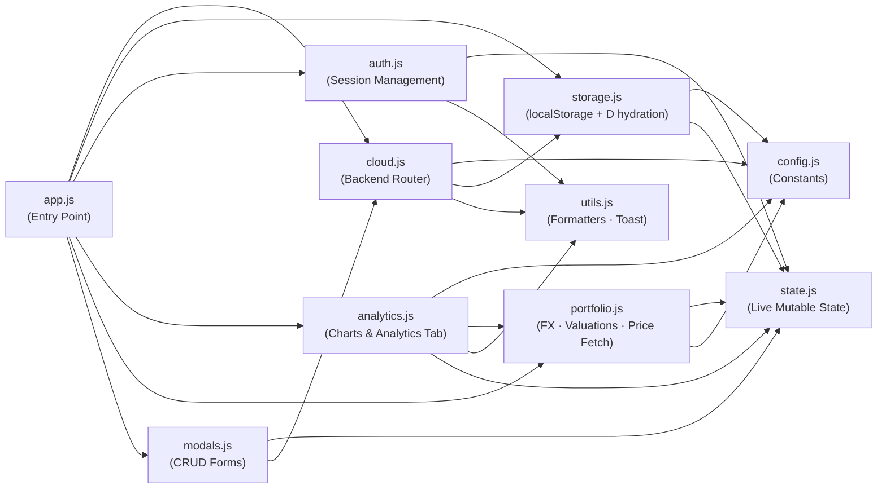

# Track CMG — System Architecture

> **Document Version:** 2.0 (Phase 7.2 — Supabase Primary)
> **Last Updated:** April 12, 2026
> **Status:** Authoritative Source of Truth
> **Branch:** `develop`

This document supersedes all prior architecture notes. If any other document in this
repository contradicts the information here, this file takes precedence.

---

## Table of Contents

1. [Application Overview](#1-application-overview)
2. [System Architecture Diagram](#2-system-architecture-diagram)
3. [Module Dependency Graph](#3-module-dependency-graph)
4. [Data Flow Logic](#4-data-flow-logic)
   - 4.1 [Hybrid Storage Strategy](#41-hybrid-storage-strategy)
   - 4.2 [Load Sequence on App Start](#42-load-sequence-on-app-start)
   - 4.3 [Proxy Pattern — Yahoo Finance via GAS](#43-proxy-pattern--yahoo-finance-via-gas)
5. [Migration & Security Protocols](#5-migration--security-protocols)
   - 5.1 [Hidden Migration Bridge](#51-hidden-migration-bridge)
   - 5.2 [SHA-256 Security Flow](#52-sha-256-security-flow)
   - 5.3 [Wipe & Insert Policy](#53-wipe--insert-policy)
6. [Database Schema](#6-database-schema)
   - 6.1 [JSONB Payload Strategy](#61-jsonb-payload-strategy)
   - 6.2 [Table Reference](#62-table-reference)
   - 6.3 [Row-Level Security](#63-row-level-security)
7. [Configuration Reference](#7-configuration-reference)
8. [Application State Model](#8-application-state-model)
9. [Authentication Model](#9-authentication-model)
10. [Offline & Error Handling](#10-offline--error-handling)

---

## 1. Application Overview

**Track CMG** is a personal financial dashboard for tracking investment portfolios,
closed trades, dividends, and personal habit metrics (gym, books, movies, series).

It is a **fully serverless, zero-backend** application:

- **No dedicated server.** Static files (`HTML`, `CSS`, vanilla `ES6 Modules`) are
  served by GitHub Pages. Zero build step, zero transpilation.
- **No secrets in the frontend.** The Supabase `ANON_KEY` is public by design and is
  protected exclusively by **Row-Level Security (RLS)** policies enforced on the
  Supabase server. No private key, no OAuth secret, no API token is stored in code.
- **Two external services:**
  - **Supabase** — PostgreSQL + PostgREST REST API. Primary and authoritative storage.
  - **Google Apps Script (GAS)** — CORS proxy to fetch real-time stock prices from
    Yahoo Finance. Also serves as the legacy storage backend (pre-Phase 7, deprecated).

---

## 2. System Architecture Diagram



### Component Responsibilities

| Component | Role | Technology |
|-----------|------|------------|
| User Browser | Render UI, execute business logic, manage all state | Vanilla JS ES6 Modules, Chart.js |
| Supabase | Persistent CRUD storage | PostgreSQL + PostgREST |
| Google Apps Script | CORS proxy for Yahoo Finance; legacy migration source | Google Apps Script `doGet()` |
| GitHub Pages | Static file hosting | Git + GitHub Pages |

---

## 3. Module Dependency Graph



**Critical design constraint:** `state.js` exports **live bindings** (`export let`).
Any module that imports `_authed`, `_token`, or `_pendingAction` always reads the
current value — not a snapshot from import time. All mutations must go through the
provided setter functions (`setAuthed`, `setToken`, `setPendingAction`).

---

## 4. Data Flow Logic

### 4.1 Hybrid Storage Strategy

The application operates under a **dual-backend model** controlled by a single
constant in `js/config.js`:

```js
export const STORAGE_MODE = 'supabase'; // 'supabase' | 'gas'
```

The public router in `cloud.js` dispatches all I/O through this flag:

```
fetchDataFromCloud()
  ├─ STORAGE_MODE === 'supabase'  →  _loadFromSupabase()  [DEFAULT]
  └─ STORAGE_MODE === 'gas'       →  _loadFromGAS()

pushDataToCloud()
  ├─ STORAGE_MODE === 'supabase'  →  _saveToSupabase()    [DEFAULT]
  └─ STORAGE_MODE === 'gas'       →  _saveToGAS()
```

**Why Supabase is the primary backend:**

| Criterion | Supabase | GAS / Google Sheets (legacy) |
|-----------|----------|------------------------------|
| Read latency | ~100–300 ms (direct SDK) | ~800–2 000 ms (cold start) |
| Write reliability | Transactional, ACID | Sheets can conflict on concurrent writes |
| CORS | Native (SDK handles it) | Required a proxy layer |
| Scalability | PostgreSQL, no practical row limit | Google Sheets 5M cell limit |
| Cost | Free tier covers personal use | Free but latency penalises UX |
| Data ownership | Exportable PostgreSQL | Locked to Google ecosystem |

**GAS mode is maintained** for emergency fallback and to support the one-time
migration workflow. It is **not** the production default.

> ⚠️ **Warning:** Setting `STORAGE_MODE = 'gas'` in production will revert to the
> legacy backend. All data written since the Supabase migration will be invisible
> until the mode is restored.

### 4.2 Load Sequence on App Start

```
app.init()
 └─ restoreSession()        ← check sessionStorage for valid token (TTL 8 h)
 └─ loadData()
      ├─ loadLocal()         ← hydrate D from localStorage instantly (sync)
      └─ fetchDataFromCloud() ← async; Supabase 6 parallel SELECTs
           ├─ loadDataFromObj(obj, merge=true)
           ├─ saveLocal()      ← write merged cloud state back to localStorage
           └─ updateSyncStatus('ok' | 'err' | 'local')
 └─ renderAll()              ← paint UI from D
```

> **Empty database is not an error.** If Supabase returns zero rows across all tables
> (first-run state), `_loadFromSupabase()` calls `loadDataFromObj(FALLBACK, true)`
> and returns `true`. The app starts in a clean, empty state — not an error state.

### 4.3 Proxy Pattern — Yahoo Finance via GAS

Yahoo Finance has no CORS-compliant public API. Direct `fetch()` from the browser
is blocked by the browser's same-origin policy.

**Solution:** All price/quote requests route through the GAS Web App, which runs
server-side and is exempt from browser CORS restrictions.

```
Browser                        GAS Web App                    Yahoo Finance
  │                                 │                               │
  │─── fetch(PROXY_URL +            │                               │
  │          ?action=quote          │                               │
  │          &ticker=AAPL) ────────►│                               │
  │                                 │── UrlFetchApp.fetch(          │
  │                                 │     query1.finance.yahoo.com) │
  │                                 │◄── JSON price data ───────────│
  │◄── JSON (CORS-free) ────────────│                               │
```

`PROXY_URL` in `config.js` holds the deployed GAS Web App URL. This is the same
endpoint used for the legacy `getData` action and the migration bridge.

---

## 5. Migration & Security Protocols

### 5.1 Hidden Migration Bridge

The Migration Bridge is a **one-time developer tool** that transfers all data from
legacy Google Sheets (via GAS) to Supabase. It is intentionally hidden from the
production UI to prevent accidental activation by non-technical users.

#### Activation Triggers

| Method | Mechanic |
|--------|----------|
| **Triple-click** | Click the `<h1>Track CMG</h1>` dashboard title 3 times within 600 ms |
| **Keyboard shortcut** | `Ctrl + Shift + M` anywhere on the page |

Both triggers call `_showMigrationModal()` in `app.js`, which **dynamically injects**
the modal HTML into `<body>` at runtime. The modal does not exist in `index.html`
source — it is created entirely in JavaScript to keep the easter egg invisible to
casual source inspection.

#### Suppression Flag

```js
localStorage.setItem('HIDE_MIGRATION_NOTICE', '1');
```

If a user checks "Don't show this tool again" in the modal, the triple-click trigger
is suppressed on subsequent visits. The keyboard shortcut (`Ctrl+Shift+M`) always
works regardless of this flag — it is reserved for developer access.

> ⚠️ **After a successful migration:** Remove the entire `// MIGRATION BRIDGE` block
> from `app.js` and the `migrateFromGAS()` export from `cloud.js`. The triple-click
> listener on `document.querySelector('h1')` can also be removed.

### 5.2 SHA-256 Security Flow

The password entered in the migration modal is **never transmitted in plain text**.

```
User types password in <input type="password">
         │
         ▼
  _sha256hex(rawPassword)                        [app.js]
    └─ crypto.subtle.digest('SHA-256',
         new TextEncoder().encode(rawPassword))
    └─ ArrayBuffer → hex string (64 characters)
         │
         ▼
  migrateFromGAS(hexHash)                        [cloud.js]
    └─ fetch(PROXY_URL
         + '?action=getData'
         + '&t=' + Date.now()
         + '&pwd=' + encodeURIComponent(hexHash))
         │
         ▼
  GAS doGet(e)                                   [Google Apps Script]
    └─ Compare e.parameter.pwd against stored hash
    └─ Match  → return full data JSON
    └─ No match → return { "error": "Unauthorized" }
```

The SHA-256 hash is computed entirely within the browser using the **Web Crypto API**
(`crypto.subtle`) — zero external libraries, zero network round-trips for hashing.

### 5.3 Wipe & Insert Policy

Every `_saveToSupabase()` and `migrateFromGAS()` call follows a **Wipe & Insert**
strategy for array-type data:

```
Phase 1 — DELETE
  DELETE FROM holdings      WHERE user_id = 'default_user'
  DELETE FROM closed_trades WHERE user_id = 'default_user'
  DELETE FROM media         WHERE user_id = 'default_user'
  DELETE FROM gym           WHERE user_id = 'default_user'

Phase 2 — INSERT
  INSERT INTO holdings      (new rows from D.holdings)
  INSERT INTO closed_trades (new rows from D.closedTrades)
  INSERT INTO media         (new rows from D.books + D.movies + D.series)
  INSERT INTO gym           (new rows from D.gym)

Phase 3 — UPSERT (merge, not replace)
  UPSERT INTO history  ON CONFLICT (user_id, snapped_at) DO UPDATE
  UPSERT INTO settings ON CONFLICT (user_id) DO UPDATE
```

> ⚠️ **Data Loss Risk:** Phase 1 deletions are irreversible within the operation.
> If Phase 2 inserts fail mid-batch, the database will be in a partially wiped state.
> All operations are batched in a single `Promise.all()`. If any operation rejects,
> the error is caught and the user is alerted — but there is no automatic rollback.
> Always export a backup from the Supabase dashboard before executing the migration.

**Why Wipe & Insert instead of individual UPSERTs?**

- A holding's primary business key (`ticker`) can change (stock splits, renames).
  Upsert keyed on `ticker` would leave orphan rows.
- The in-memory `D` array represents the **full canonical state**. Partial diffing
  would require complex change-set logic for negligible gain in a single-user app.
- `history` and `settings` use UPSERT because their keys are stable and append-safe.

---

## 6. Database Schema

### 6.1 JSONB Payload Strategy

All domain objects are stored in a **`payload JSONB`** column. Only fields that
require server-side filtering or ordering are promoted to dedicated scalar columns
(`user_id`, `ticker`, `type`, `log_date`, `snapped_at`).

**Rationale:**
- The data model evolves frequently; new fields added to holdings or trades require
  no schema migration.
- JSONB is fully indexable and queryable in PostgreSQL when needed.
- Single-user personal app — the cost of flexible schema outweighs strict typing.

**Trade-off:** No database-level enforcement of payload field presence or type.
Data integrity is the responsibility of the JavaScript application layer (`storage.js`).

### 6.2 Table Reference

#### `holdings` — Open Investment Positions

| Column | Type | Constraints | Description |
|--------|------|-------------|-------------|
| `id` | `uuid` | PK, `gen_random_uuid()` | Row identifier |
| `user_id` | `text` | NOT NULL | Owner. Currently always `'default_user'` |
| `ticker` | `text` | NOT NULL | Stock ticker (e.g. `'AAPL'`). Promoted for indexing |
| `payload` | `jsonb` | NOT NULL | Full holding object |
| `created_at` | `timestamptz` | default `now()` | Auto-set by Supabase |

Representative `payload` shape:
```json
{
  "ticker": "AAPL",
  "shares": 10,
  "entryPrice": 150.00,
  "currency": "USD",
  "sector": "Technology",
  "dividends": 12.50
}
```

---

#### `closed_trades` — Completed Positions

| Column | Type | Constraints | Description |
|--------|------|-------------|-------------|
| `id` | `uuid` | PK | Row identifier |
| `user_id` | `text` | NOT NULL | Owner identifier |
| `ticker` | `text` | NOT NULL | Stock ticker |
| `payload` | `jsonb` | NOT NULL | Full closed trade object |
| `created_at` | `timestamptz` | default `now()` | Auto-set |

Representative `payload` shape:
```json
{
  "ticker": "MSFT",
  "totalShares": 5,
  "avgBuy": 280.00,
  "sellPrice": 320.00,
  "currency": "USD",
  "realizedPnl": 200.00,
  "dividends": 8.00
}
```

---

#### `media` — Books, Movies, Series

Single table with a `type` discriminator column.

| Column | Type | Constraints | Description |
|--------|------|-------------|-------------|
| `id` | `uuid` | PK | Row identifier |
| `user_id` | `text` | NOT NULL | Owner identifier |
| `type` | `text` | NOT NULL | `'book'`, `'movie'`, or `'serie'` |
| `payload` | `jsonb` | NOT NULL | Full media object |
| `created_at` | `timestamptz` | default `now()` | Auto-set |

---

#### `gym` — Workout Log

| Column | Type | Constraints | Description |
|--------|------|-------------|-------------|
| `id` | `uuid` | PK | Row identifier |
| `user_id` | `text` | NOT NULL | Owner identifier |
| `log_date` | `date` | NOT NULL | Workout date. Promoted for range queries |
| `payload` | `jsonb` | NOT NULL | Full workout log entry |

---

#### `history` — Portfolio Value Snapshots

| Column | Type | Constraints | Description |
|--------|------|-------------|-------------|
| `id` | `uuid` | PK | Row identifier |
| `user_id` | `text` | NOT NULL | Owner identifier |
| `snapped_at` | `date` | NOT NULL | Snapshot date |
| `payload` | `jsonb` | NOT NULL | `{ date, totalInvested, totalValue }` |

**Unique constraint:** `UNIQUE (user_id, snapped_at)` — enables safe UPSERT.

Rows are read ordered by `snapped_at ASC` and used to render the performance chart.

---

#### `settings` — Per-User Scalar Configuration

| Column | Type | Constraints | Description |
|--------|------|-------------|-------------|
| `user_id` | `text` | PK | Owner identifier |
| `cash` | `numeric` | NOT NULL, default `0` | Current cash balance (EUR) |
| `total_invested` | `numeric` | NOT NULL, default `0` | Total capital deployed (EUR) |
| `updated_at` | `timestamptz` | | Last write timestamp |

Single row per user. UPSERTed on every save. Never deleted.

---

### 6.3 Row-Level Security

All tables enforce RLS. Policies for the current single-user deployment:

```sql
-- Enable RLS
ALTER TABLE holdings      ENABLE ROW LEVEL SECURITY;
ALTER TABLE closed_trades ENABLE ROW LEVEL SECURITY;
ALTER TABLE media         ENABLE ROW LEVEL SECURITY;
ALTER TABLE gym           ENABLE ROW LEVEL SECURITY;
ALTER TABLE history       ENABLE ROW LEVEL SECURITY;
ALTER TABLE settings      ENABLE ROW LEVEL SECURITY;

-- Allow all operations for the hardcoded default user
-- (anon key is the only credential used by the frontend)
CREATE POLICY "allow_default_user" ON holdings
  FOR ALL USING (user_id = 'default_user') WITH CHECK (user_id = 'default_user');

-- Repeat for every table
```

> ⚠️ **Fase 7.3 Multi-User Upgrade:** When Supabase Auth is introduced, replace
> `user_id = 'default_user'` with `user_id = auth.uid()::text` in all RLS policies,
> and replace `const UID = 'default_user'` in `cloud.js` with the authenticated
> user's UID obtained from `(await supabase.auth.getUser()).data.user.id`.

---

## 7. Configuration Reference

All constants are defined in `js/config.js` as plain ES module exports.
There is **no build step**, **no `.env` file**, **no environment variables**.

| Constant | Type | Purpose | Example Value |
|----------|------|---------|---------------|
| `STORAGE_MODE` | `'supabase' \| 'gas'` | Active backend router | `'supabase'` |
| `SUPABASE_URL` | `string` | Supabase project URL | `'https://xxxxx.supabase.co'` |
| `SUPABASE_ANON_KEY` | `string` | Supabase public anon key | `'eyJhbGci...'` |
| `PROXY_URL` | `string` | Deployed GAS Web App URL | `'https://script.google.com/...'` |
| `TRADE_FX` | `object` | Static FX fallback rates (EUR base) | `{ EUR:1, USD:0.8696, ... }` |
| `FALLBACK` | `object` | Default empty data on first run | `{ holdings:[], cash:0, ... }` |

> ⚠️ **Security Note:** `SUPABASE_ANON_KEY` is intentionally public. It grants **only**
> what Supabase RLS policies explicitly permit. Never confuse it with the
> **service role key**, which bypasses RLS and must never appear in frontend code.

---

## 8. Application State Model

All mutable runtime state is centralised in `js/state.js` and exported as live
bindings. No component stores its own separate copy of domain data.

```
state.js
├── D                — Main data object (hydrated from Supabase or localStorage)
│   ├── holdings[]
│   ├── closedTrades[]
│   ├── cash
│   ├── totalInvested
│   ├── history[]
│   ├── gym[]
│   ├── books[]
│   ├── movies[]
│   └── series[]
├── _authed          — boolean: user is in edit-mode
├── _token           — session token string (stored in sessionStorage, TTL 8 h)
└── _pendingAction   — deferred action waiting for auth to complete
```

`D` is the canonical in-memory representation of the database. All renders read from
`D`. Mutations to `D` should call `saveAndSync()` (saves locally and pushes to cloud)
or at minimum `saveLocal()` (localStorage only, no cloud push).

---

## 9. Authentication Model

Track CMG implements a **session-based, password-free** edit-mode gate:

1. On load, `restoreSession()` checks `sessionStorage` for a valid token (TTL: 8 h).
2. If no valid token exists, the app loads in **read-only mode** — all data is visible,
   no edit controls are shown.
3. Any edit action calls `authThenAction(action)`, which shows the auth overlay.
4. `checkAuth()` on submit generates a random UUID token via `crypto.randomUUID()`
   and stores it in `sessionStorage`. No server round-trip; no password comparison.
5. The token gates the edit-mode UI only. It is **not** sent to Supabase.

**Security model:** UI-level access control. Data integrity and access control at the
storage level is enforced by **Supabase RLS**. The `ANON_KEY` + RLS model means that
any actor who knows the Supabase URL and key can write data directly via the REST API.
For a single-user personal dashboard, this is an accepted and understood trade-off.

---

## 10. Offline & Error Handling

| Scenario | Behaviour |
|----------|-----------|
| Supabase unreachable on load | `fetchDataFromCloud()` returns `false`; app loads from `localStorage`; sync indicator → `'err'` |
| Supabase returns empty tables | Valid first-run state; `D` hydrated from `FALLBACK`; returns `true` |
| `_saveToSupabase()` write fails | `toast('Sync failed', 'err')` shown; `localStorage` copy remains intact |
| GAS proxy unreachable (price fetch) | Quote fields show `N/A`; no crash; chart renders with cached prices |
| `window.supabase` CDN not yet loaded | `_getSupabase()` throws a clear error; caught by calling function; graceful fallback |
| `SUPABASE_URL` or `ANON_KEY` not set | `_loadFromSupabase` / `_saveToSupabase` short-circuit immediately; status → `'local'` |
| Migration: GAS returns `{ error }` | `migrateFromGAS()` returns `{ ok: false }`; user shown alert; Supabase not touched |
| Migration: Supabase write fails mid-batch | Caught; user alerted; Supabase may be in partial state; no automatic rollback |

