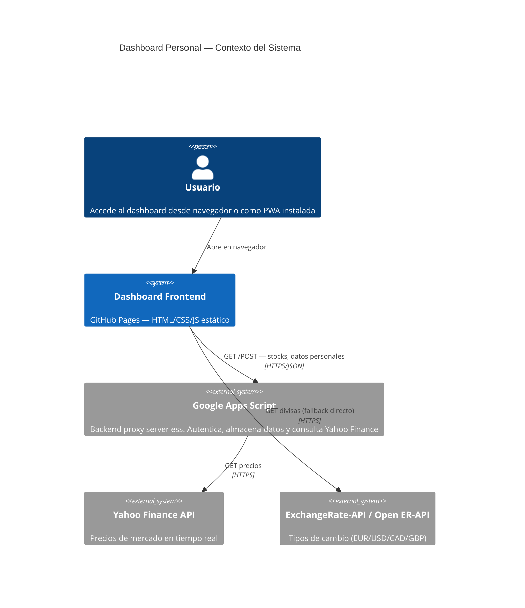
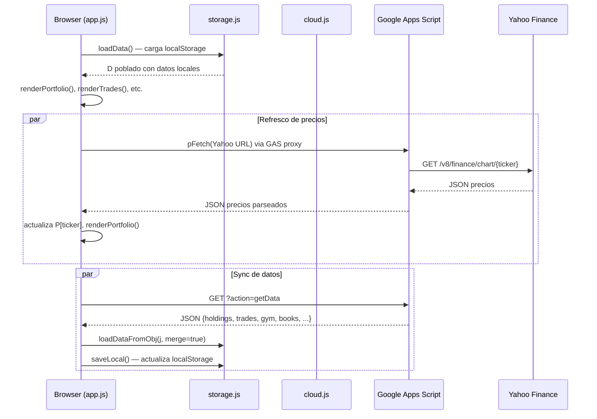
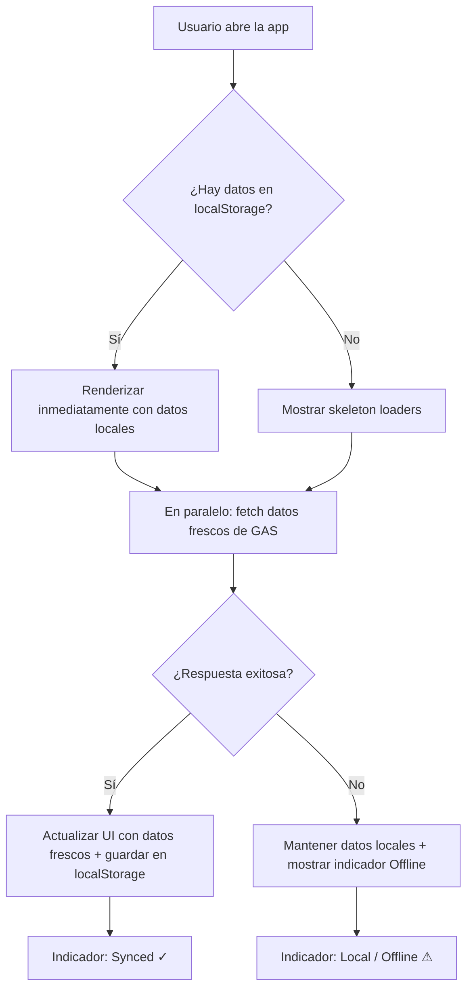

# Arquitectura del Sistema

## Visión General

Dashboard financiero personal estático desplegado en GitHub Pages. Todo el código sensible (precios de mercado, datos de usuario) se gestiona mediante Google Apps Script como backend proxy sin coste.

---

## Diagrama C4 — Contexto



---

## Diagrama C4 — Contenedores

```mermaid
C4Container
  title Dashboard — Contenedores

  Person(user, "Usuario")

  Container(html, "index.html", "HTML5", "Estructura de la interfaz. Sin lógica inline.")
  Container(css, "css/styles.css", "CSS3", "Design system: variables, componentes, responsive")
  Container(app, "js/app.js", "ES Module", "Entry point. Inicialización, routing de tabs, listeners globales")
  Container(config, "js/config.js", "ES Module", "Constantes: GAS_URL placeholder, TRADE_FX")
  Container(state, "js/state.js", "ES Module", "Estado mutable compartido: D (datos), _authed")
  Container(storage, "js/storage.js", "ES Module", "localStorage: carga, guarda, migra datos")
  Container(cloud, "js/cloud.js", "ES Module", "Comunicación GAS: GET datos, POST sync")
  Container(portfolio, "js/portfolio.js", "ES Module", "Estado P/FX, fetch precios, renders portfolio")
  Container(modals, "js/modals.js", "ES Module", "Sistema de modales y formularios CRUD")
  Container(auth, "js/auth.js", "ES Module", "SHA-256, validación contraseña, eventos auth")

  Rel(user, html, "Carga")
  Rel(html, app, "type=module")
  Rel(app, config, "import")
  Rel(app, state, "import")
  Rel(app, storage, "import")
  Rel(app, cloud, "import")
  Rel(app, portfolio, "import")
  Rel(app, modals, "import")
  Rel(app, auth, "import")
  Rel(cloud, gas, "fetch HTTPS")
  Rel(portfolio, gas, "fetch via pFetch proxy")
```

---

## Flujo de Datos Principal



---

## Estrategia de Caché (Stale-While-Revalidate)



---

## TTL de Caché por Tipo de Dato

| Origen | TTL | Condición de revalidación |
|---|---|---|
| Precios de stocks (Yahoo via GAS) | 60 s | Solo si tab visible + ≥ 60s desde último fetch |
| Tipos de cambio FX | 1 hora | Máx 1 vez/hora por sesión |
| Datos propios (GAS sync) | Sin expiración | Solo tras acción de escritura |
| Datos estáticos (books, series…) | Sin expiración | Solo si hay cambios pendientes |
