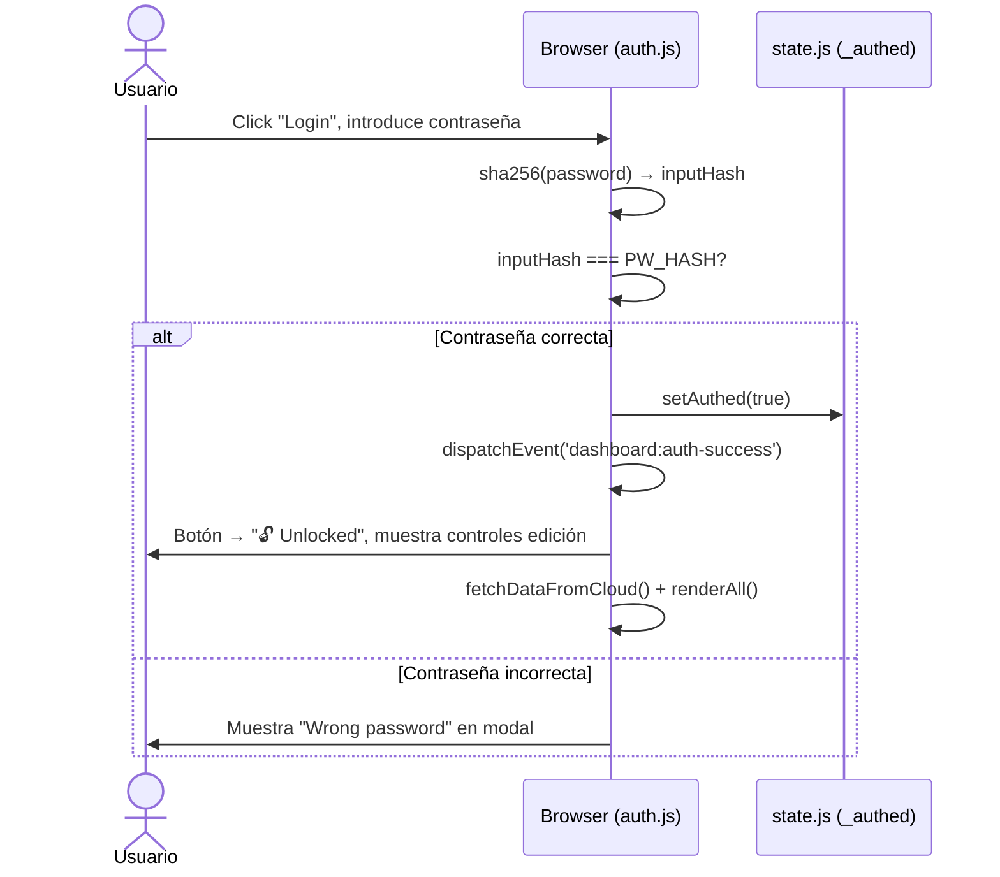
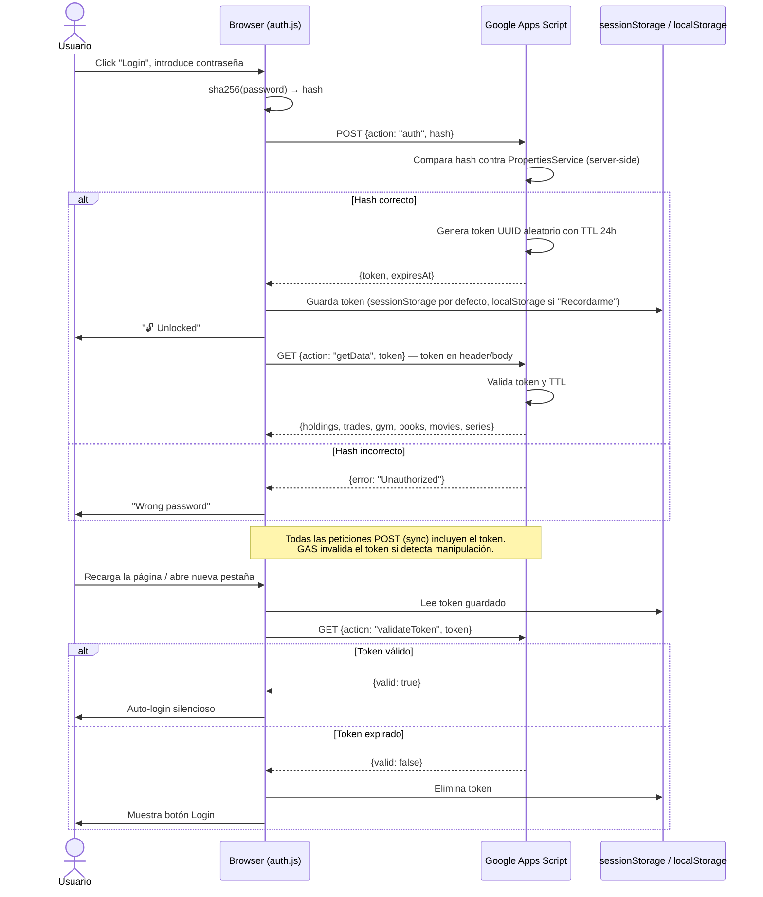

# Flujo de Autenticación

## Estado Actual (Fase 1) — SHA-256 Client-Side

La contraseña se valida en el frontend comparando el hash SHA-256 del input contra una constante `PW_HASH` en `config.js`. No hay token de sesión; el estado `_authed` vive en memoria de la pestaña.

**Limitaciones de seguridad actuales:**
- `PW_HASH` es públicamente visible en el source del repositorio (aunque no es la contraseña en texto plano)
- Sin token de sesión: cerrar y reabrir la pestaña requiere re-autenticación (✓ buena práctica)
- Sin protección contra fuerza bruta en frontend (no relevante para uso personal)
- GAS acepta peticiones con el hash como "password", pero cualquiera que vea el source puede enviar el hash

---

## Estado Objetivo (Fase 2) — Token server-side via GAS

**Mejoras de seguridad en Fase 2:**
- `PW_HASH` desaparece del frontend
- Validación siempre server-side (GAS `PropertiesService`)
- Token con TTL: exposición limitada en el tiempo
- Cada sync verifica token: no es posible hacer escrituras sin autenticación válida

---

## Comparativa de Seguridad

| Aspecto | Fase 1 (actual) | Fase 2 (objetivo) |
|---|---|---|
| Validación de contraseña | Client-side (SHA-256) | Server-side (GAS) |
| Estado de sesión | `_authed` en memoria | Token en sessionStorage/localStorage |
| Persistencia de sesión | No (se pierde al recargar) | Sí, con TTL configurable |
| Secrets en frontend | `PW_HASH` visible | Sin secrets en frontend |
| Protección de escrituras | Condicional en JS | Token requerido en GAS |

---

## Intervención Humana Requerida para Fase 2

Para implementar el flujo objetivo, se debe modificar el código de Google Apps Script con:

1. **Endpoint `auth`**: recibe hash, compara contra `PropertiesService.getScriptProperties().getProperty('PW_HASH')`, genera y almacena token UUID con TTL
2. **Middleware de token**: cada endpoint `getData`, `setData`, etc. verifica el token antes de operar
3. **Endpoint `validateToken`**: comprueba si un token sigue siendo válido

El código GAS de referencia se proporcionará al inicio de la Fase 2.
