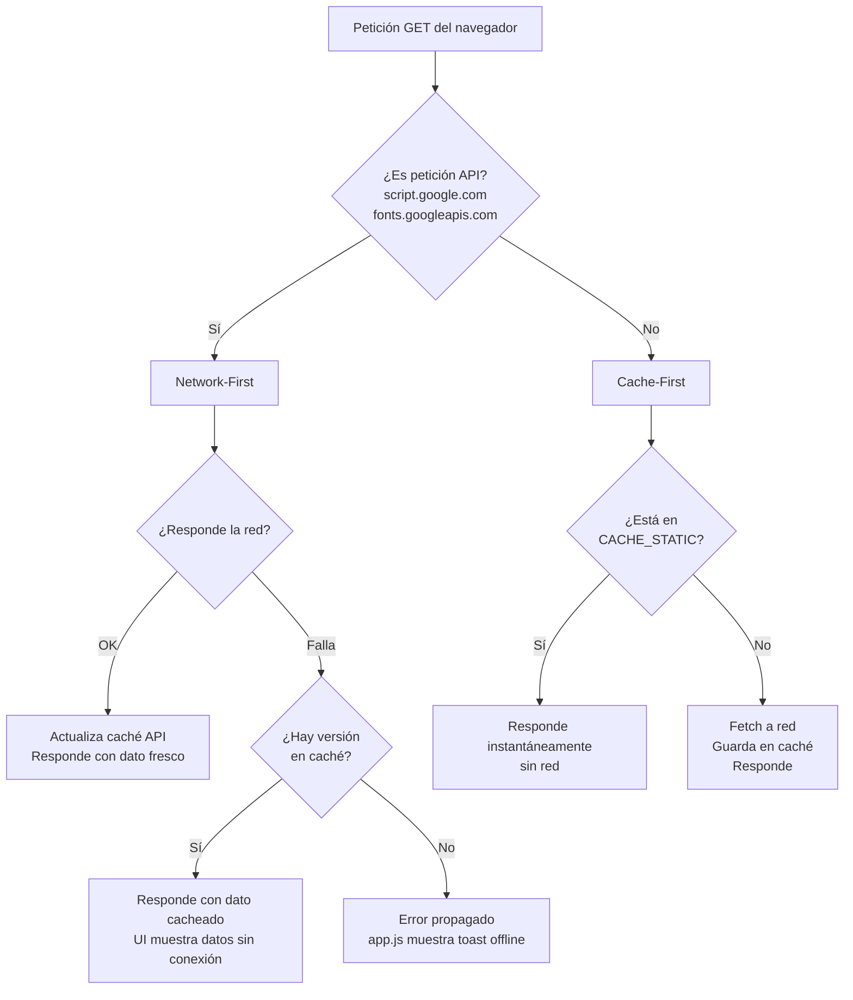
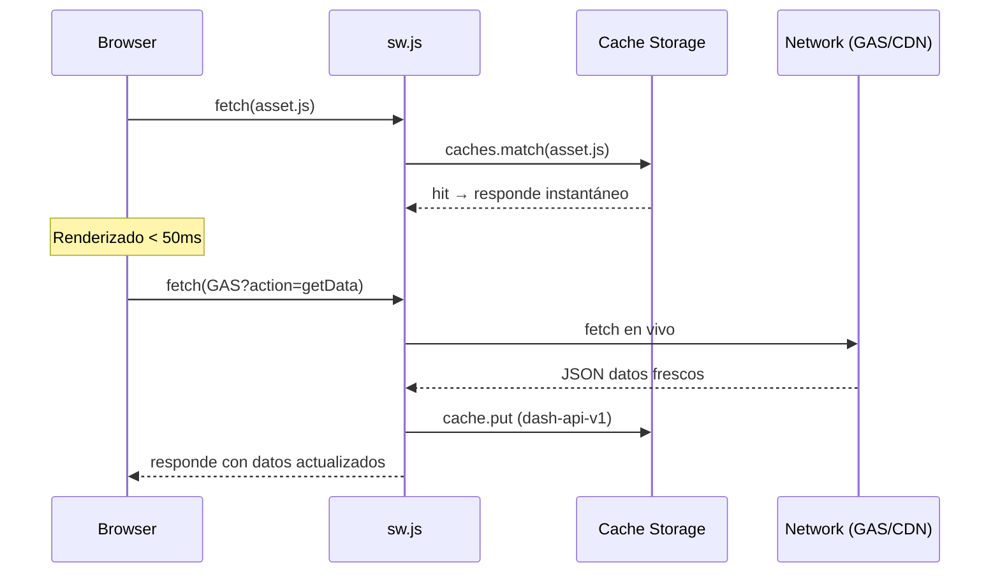

# Estrategia de Caché del Service Worker

## Resumen

El Service Worker del dashboard implementa dos estrategias diferenciadas según el tipo de recurso, logrando que la app funcione completamente offline después de la primera visita.

---

## Diagrama de decisión de estrategia



---

## Cachés utilizadas

| Nombre | Contenido | Estrategia | TTL |
|---|---|---|---|
| `dash-static-v1` | HTML, CSS, JS modules, manifest, Chart.js CDN | Cache-First | Hasta nuevo `CACHE_VERSION` |
| `dash-api-v1` | Respuestas de GAS (getter datos, proxy Yahoo) | Network-First con fallback | Hasta nuevo `CACHE_VERSION` |

La versión se incrementa en `sw.js` mediante la constante `CACHE_VERSION`. Cambiarla invalida automáticamente todas las cachés antiguas en el evento `activate`.

---

## Precarga en Install (App Shell)

Los siguientes recursos se precachean la primera vez que el usuario visita la app:

- `/index.html`
- `/css/styles.css`
- Todos los módulos JS (`/js/*.js`)
- `/manifest.json`
- `chart.umd.min.js` (CDN cdnjs)

Esto garantiza que la interfaz completa cargue instantáneamente en visitas posteriores, incluso sin conexión.

---

## Comportamiento offline

| Situación | Resultado |
|---|---|
| Sin conexión, primer uso | ❌ No funciona (sin caché inicial) |
| Sin conexión, ya visitado | ✅ UI completa + datos de la última sesión |
| GAS timeout / error | ✅ Datos del caché API + `syncStatus` muestra "Local" |
| Vuelta a online | ✅ Event `online` → toast "Back online" |

---

## Ciclo de vida



---

## Invalidación de caché

Para forzar que todos los usuarios descarguen activos actualizados, incremente `CACHE_VERSION` en `sw.js`:

```javascript
const CACHE_VERSION = 'v2'; // ← cambiar al desplegar nueva versión
```

El evento `activate` del SW borra automáticamente `dash-static-v1` y `dash-api-v1`, reemplazándolos por `dash-static-v2` y `dash-api-v2`.
